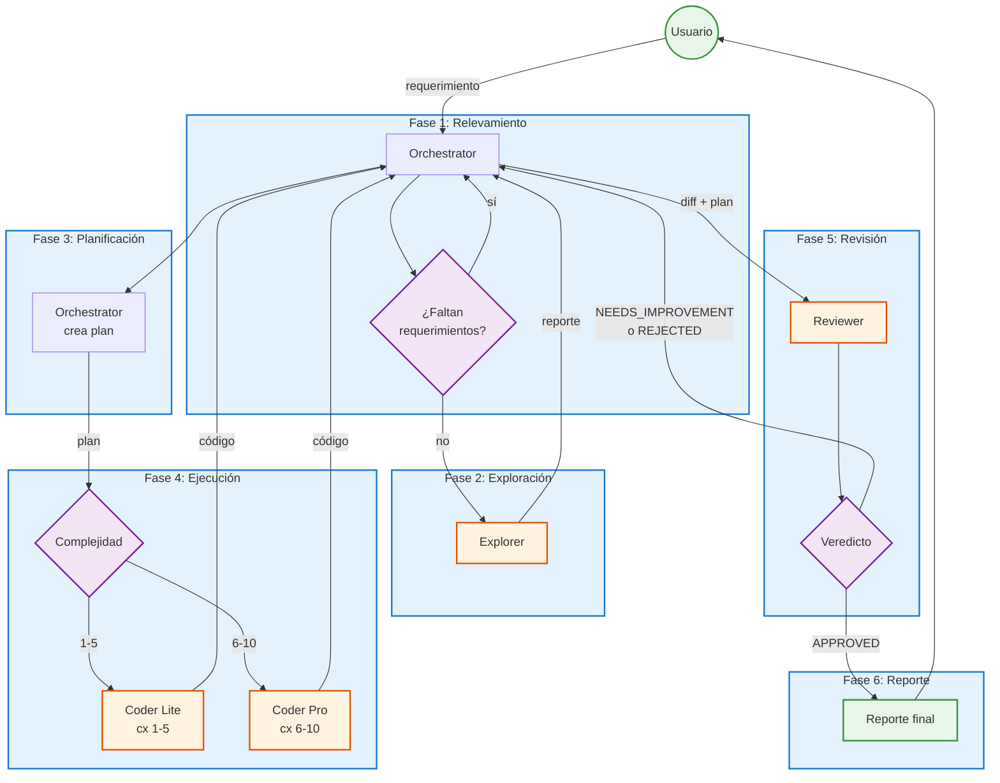

```mermaid
graph TD
    User((Usuario))

    subgraph Phase1["Fase 1: Relevamiento"]
        O[Orchestrator]
        Q{¿Faltan<br>requerimientos?}
    end

    subgraph Phase2["Fase 2: Exploración"]
        E[Explorer]
    end

    subgraph Phase3["Fase 3: Planificación"]
        P[Orchestrator<br>crea plan]
    end

    subgraph Phase4["Fase 4: Ejecución"]
        Selector{Complejidad}
        CL[Coder Lite<br>cx 1-5]
        CP[Coder Pro<br>cx 6-10]
    end

    subgraph Phase5["Fase 5: Revisión"]
        R[Reviewer]
        Decision{Veredicto}
    end

    subgraph Phase6["Fase 6: Reporte"]
        Report[Reporte final]
    end

    User -->|"requerimiento"| O
    O --> Q
    Q -->|"sí"| O
    Q -->|"no"| E
    E -->|"reporte"| O
    O --> P
    P -->|"plan"| Selector
    Selector -->|"1-5"| CL
    Selector -->|"6-10"| CP
    CL -->|"código"| O
    CP -->|"código"| O
    O -->|"diff + plan"| R
    R --> Decision
    Decision -->|"NEEDS_IMPROVEMENT<br>o REJECTED"| O
    Decision -->|"APPROVED"| Report
    Report --> User

    classDef phase fill:#e3f2fd,stroke:#1976d2,stroke-width:2px;
    classDef agent fill:#fff3e0,stroke:#e65100,stroke-width:2px;
    classDef decision fill:#f3e5f5,stroke:#7b1fa2,stroke-width:2px;
    classDef startEnd fill:#e8f5e9,stroke:#388e3c,stroke-width:2px;

    class Phase1,Phase2,Phase3,Phase4,Phase5,Phase6 phase;
    class E,CL,CP,R agent;
    class Q,Selector,Decision decision;
    class User,Report startEnd;
```